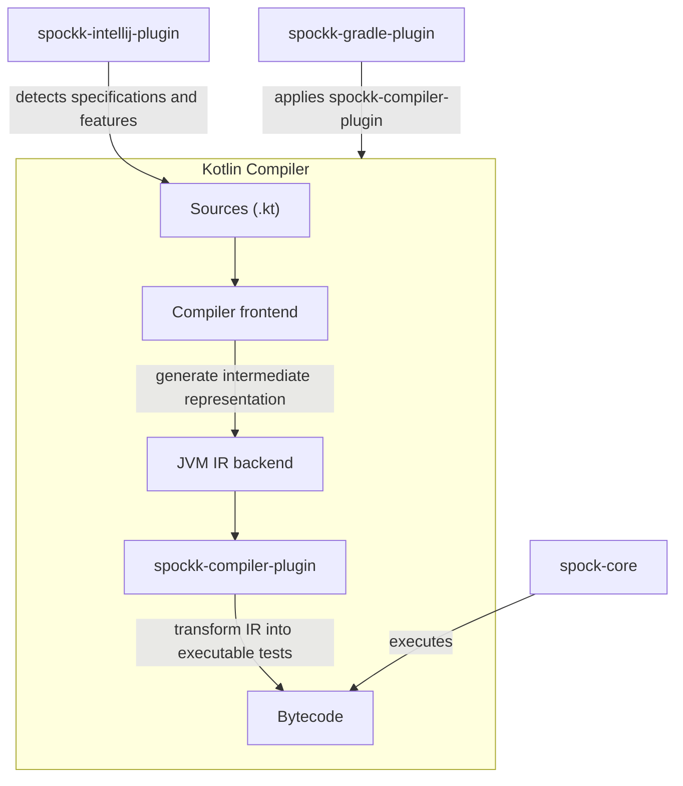

<h1>
  <picture width="200">
    <source media="(prefers-color-scheme: dark)" srcset="https://raw.githubusercontent.com/pshevche/spockk/refs/heads/main/spockk-docs/docs/images/name_with_icon_dark.svg">
    <source media="(prefers-color-scheme: light)" srcset="https://raw.githubusercontent.com/pshevche/spockk/refs/heads/main/spockk-docs/docs/images/name_with_icon_light.svg">
    
  </picture>
</h1>

This repository is home to Spockk, an add-on for the [Spock](https://github.com/spockframework/spock) testing framework that brings its expressive BDD-style syntax for Groovy to Kotlin.

## Sneak peek

```kotlin
import io.github.pshevche.spockk.lang.and
import io.github.pshevche.spockk.lang.given
import io.github.pshevche.spockk.lang.`when`
import io.github.pshevche.spockk.lang.then
import spock.lang.Specification

class MyFirstSpecification : Specification() {
    fun `adding an element to a list`() {
        given
        val myList = mutableListOf<Int>()

        `when`
        myList.add(1)

        and
        myList.add(2)

        then
        assert(myList.size == 2)
    }
}
```

## Getting started

- [User guide](https://pshevche.github.io/spockk/)
- [Example project](https://github.com/pshevche/spockk-example)

## Development

### High-level design

The Spock framework for Groovy relies on AST transformations to transform its expressive specification syntax into
runnable specification classes.
The Spockk add-on achieves a similar behavior by implementing a Kotlin compiler
plugin ([examples](https://kotlinlang.org/docs/all-open-plugin.html#0)).
The following diagram shows the simplified interaction between all the different components that Spockk is composed of.



### Modules

- [`spockk-compiler-plugin`](spockk-compiler-plugin/README.adoc): implements IR transformations that modify the
  simplified test syntax into tests compatible with Spock's test engine.
- [`spockk-core`](spockk-core/README.adoc): declares additional Kotlin-specific specification syntax.
- [`spockk-docs`](spockk-docs/README.adoc): module with user guide.
- [`spockk-gradle-plugin`](spockk-gradle-plugin/README.adoc): Gradle plugin that abstracts away the application of the
  `spockk-compiler-plugin` to Kotlin compiler invocations.
- [`spockk-intellij-plugin`](spockk-intellij-plugin/README.adoc): provides support for Spockk tests in IntelliJ.
- [`spockk-specs`](spockk-specs/README.adoc): specifications for the framework written with Spockk.
